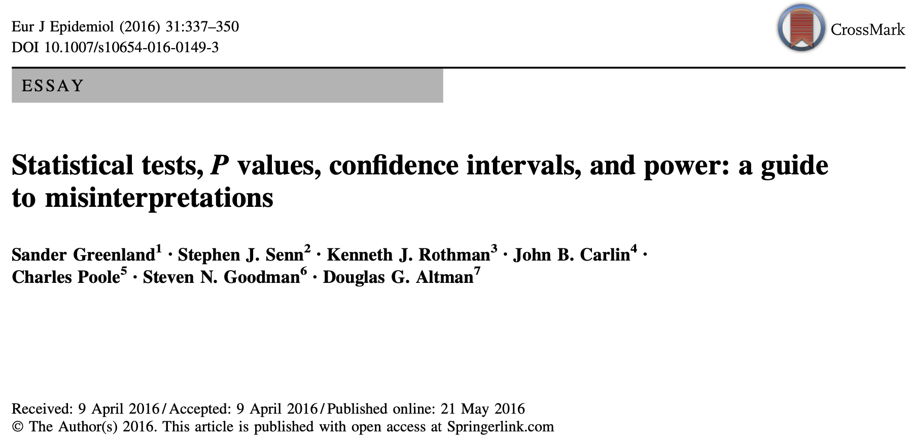

```{r setup, include=FALSE}
knitr::opts_chunk$set(echo = FALSE)
```


```{r, include=FALSE}
library(shiny)
library(ggplot2)
```


## 

::: {style="text-align: center; width: 100%;"}

:::

## Qui sont-ils ?

-   **Sander Greenland** : Professeur émérite de statistiques et d'épidémiologie, UCLA

-   **Stephen Senn** : Consultant en statistiques, Édimbourg

-   **Kenneth Rothman** : Epidémiologiste, Research Triangle Institute, Caroline du Nord

-   **John Carlin** : Département d'épidémiologie et biostatistiques, Université de Melbourne

-  **Charles poole** : Département d'épidémiologie, Université de Caroline du Nord

-  **Steven Goodman** : Professeur d'épidémiologie et biostatistiques, Université de Stanford

- **Douglas Altman** : Centre de statistiques en médecine, Université d'Oxford


## Abstract

::: {style="font-size: 20px;"}
Misinterpretation and abuse of statistical tests, confidence intervals, and statistical power have been decried for decades, yet remain rampant. A key problem is that there are no interpretations of these concepts that are at once simple, intuitive, correct, and foolproof. Instead, correct use and interpretation of these statistics requires an attention to detail which seems to tax the patience of working scientists. This high cognitive demand has led to **an epidemic of shortcut definitions and interpretations that are simply wrong, sometimes disastrously so-and yet these misinterpretations dominate much of the scientific literature**. In light of this problem, we provide **definitions and a discussion of basic statistics** that are more general and critical than typically found in traditional introductory expositions. Our goal is to provide a resource for instructors, researchers, and consumers of statistics whose knowledge of statistical theory and technique may be limited but who wish to avoid and spot misinterpretations. We emphasize how violation of often unstated analysis protocols (such as selecting analyses for presentation based on the P values they produce) can lead to small $p$ values even if the declared test hypothesis is correct, and can lead to large $p$ values even if that hypothesis is incorrect. We then provide an **explanatory list of 25 misinterpretations of** $p$ values, confidence intervals, and power. We conclude with guidelines for improving statistical interpretation and reporting.
:::

## Quizz

{width="100%"}

# Concepts statistiques de base

-   Modèle statistique

-   Statistique du test

-   $P$ value

-   Intervalle de confiance à 95% de la taille d'effet

## Cas pratique

Définition du problème: **Est-ce que cette présentation augmente l'enthousiasme des doctorants envers les statistiques ?**

2 groupes :

-   **Groupe P** : Les doctorants qui ont assisté à la présentation

-   **Groupe NP** : Les doctorants qui ont loupé leur chance de mieux comprendre les statistiques

L'enthousiasme pour les statistiques est mesuré par le temps (en minutes) passé à lire du contenu lié aux statistiques.

## Données collectées

```{r}
# Generate two random variables
set.seed(123)
x <- rnorm(20, mean = 4, sd = 1)
y <- rnorm(20, mean = 3, sd = 1)

res.test <- t.test(x,y)

# Represent the values on a single histogram
hist(x, col=rgb(0,0,1,0.2), xlab = "Temps (minutes/semaine)", ylab = "Nombre de doctorants", xlim = c(0,max(c(x,y))+1), main = "Temps passé à lire du contenu lié aux statistiques")
hist(y, col=rgb(1,0,0,0.2), add = TRUE)
legend("topright", c("Groupe P", "Groupe NP"), fill = c(rgb(0,0,1,0.2), rgb(1,0,0,0.2)))
```

## Modèle statistique

<div style="padding: 10px 20px; background-color: #f9f9f9">
  <p>"Chaque méthode d'inférence statistique **dépend d'un ensemble complexe d'hypothèses** sur la manière dont les données ont été collectées et analysées, et sur la manière dont les résultats de l'analyse ont été sélectionnés pour être présentés. L'ensemble des hypothèses est incorporé dans un modèle statistique qui sous-tend la méthode. Ce modèle est une **représentation mathématique de la variabilité des données** et devrait donc, idéalement, saisir avec précision toutes les sources de cette variabilité." </p>
  Greenland et al., 2016, p. 338
</div>

### Objectif d'un modèle statistique

Représenter la variabilité des données récoltées en prenant en compte des hypothèses sur les méthodes de récolte et d'analyse de données

### Pourquoi utiliser un modèle statistique ?

-   Permet une formalisation mathématique, et donc une généralisation des processus observés

-   Simplifie les observations en les résumant par des distributions, determinés par des paramètres

## Modèle statistique : Cas pratique

### Variables

-   Variable dépendante : Temps passé à lire du contenu lié aux statistiques

-   Variable indépendante : Groupe (P ou NP)

### Hypothèses du modèle

-   Les données sont distribuées approximativement normalement à l'intérieur de chaque groupe

-   Les variances entre les groupes sont égales (homogénéité des variances)

-   Les observations sont indépendantes les unes des autres

### Hypothèses d'étude

-   Hypothèse nulle $H_0$ : Le temps moyen passé à lire du contenu lié aux statistiques est le même pour les deux groupes ($\mu_{P} = \mu_{NP}$)

-   Hypothèse alternative $H_1$ : Le temps moyen passé à lire du contenu lié aux statistiques est différent pour les deux groupes ($\mu_{P} \neq \mu_{NP}$)

## Modèle statistique : Hypothèses du modèle

### Normalité de la distribution

- Mesure fiable de la tendance centrale $\mu$ et de la variabilité $\sigma^2$ : $X \sim N(\mu, \sigma^2)$

- **Théorème central limite** : la moyenne d'un grand nombre d'échantillons suit une distribution normale

### Homogénéité des variances

Objectif = comparer les moyennes des groupes ; si les variances sont différentes, les moyennes ne sont pas comparables

### Indépendance des observations

Assure l'indépendance des moyennes et variances des groupes

## Modèle statistique : Hypothèses d'étude

### Hypothèse nulle $H_0$

<div style="padding: 10px 20px; background-color: #f9f9f9">
  <p>"Dans la plupart des applications des tests statistiques, l'une des hypothèses du modèle est qu'un effet particulier a une taille spécifique et a été ciblé pour l'analyse statistique. [...] Cette hypothèse ciblée est appelée hypothèse d'étude ou hypothèse de test, et les méthodes statistiques utilisées pour l'évaluer sont appelées tests d'hypothèses statistiques. Le plus souvent, l'ampleur de l'effet ciblé est une valeur « nulle » représentant un effet nul [...], auquel cas l'hypothèse de test est appelée l'hypothèse nulle."</p>
<tiny>Greenland et al., 2016, p. 338</tiny>
</div>

<strong><center>Le modèle est construit en admettant que \( H_0 \) est vraie.</center></strong>

## Statistique de test

<div style="padding: 10px 20px; background-color: #f9f9f9">
  <p>"La distance entre les données et les prédictions du modèle est mesurée par une statistique de test"</p>
Greenland et al., 2016, p. 339
</div>

Une statistique de test ($t$) (Cox & Hinkley, 1974, ch. 3.2):

- Est une fonction des données / observations ($t = f(x)$)

- A une distribution de probabilité connue sous l'hypothèse nulle

- Permet de calculer à quel point les données sont inhabituelles (en supposant que les hypothèses du modèle sont vraies)


## Statistique de test : Cas pratique

On souhaite comparer les moyennes des deux groupes : calcul de la différence entre les moyennes des deux groupes

$$t = \mu_{P} - \mu_{NP}$$

Les variances des deux groupes sont égales ; on normalise pour obtenir une statistique de test indépendante de la variance

$$t = \frac{\mu_{P} - \mu_{NP}}{s_{pooled}}$$

On normalise par le nombre de sujets pour obtenir une statistique de test indépendante de la taille de l'échantillon

$$t = \frac{\mu_{P} - \mu_{NP}}{s_{pooled} \times \sqrt{\frac{1}{n_{P}} + \frac{1}{n_{NP}}}}$$

## Statistique de test : Distribution

La statistique de test (peu importe comment elle est calculée) suit une distribution de probabilité connue sous l'hypothèse nulle :

- On réalise l'expérience un grand nombre de fois et on calcule la statistique de test à chaque fois

- La distribution de certaines statistiques de test est connue et démontrée mathématiquement ; d'autres sont approximées (distribution asymptotique)

### En pratique

Prenons $q$ échantillons de taille $n_{P}$ et $n_{NP}$

Etant donné que $H_0 : \mu_P = \mu_{NP}$, on peut simuler des échantillons de taille $n_{P}$ et $n_{NP}$ à partir d'une distribution normale.

On prend $\mu_P = \mu_{NP} = 10$ et $\sigma = 1$, alors :

$$
P \sim N(10, 1), \quad \text{et} \quad NP \sim N(10, 1).
$$

On tire $q$ échantillons aléatoire de taille $n_{P}$ et $n_{NP}$ de ces distributions, et on calcule la statistique de test $t$ pour chaque échantillon.

## Statistique de test : Distribution du $t$

```{r, echo=FALSE}
# Define slider to choose number of samples, size of samples, and observed t-value
inputPanel(
  sliderInput("samplesize", "Nombre d'échantillons :",
              min = 10, max = 10000, value = 100),
  sliderInput("df", "Degrés de liberté :",
              min = 1, max = 100, value = 29),
  sliderInput("tObs", "Valeur de t observée:",
              min = -5, max = 5, value = 0, step = 0.001)
)

renderPlot({
  # Get variables from inputs
  n <- input$samplesize 
  df <- input$df

  # Define parameters for distribution from which to sample
  mu <- 10
  sd <- 1

  # Generate sample data and compute t-statistics
  t_values <- replicate(n, {
    sample_data <- rnorm(df + 1, mean = mu, sd = sd)  # simulate normal data for each sample
    t_statistic <- (mean(sample_data) - mu) / (sd(sample_data) / sqrt(length(sample_data)))
    t_statistic
  })

  pTheoretical <- mean(abs(t_values) > abs(input$tObs));
  
  # Create a ggplot histogram of t-values
  df_data <- data.frame(t = t_values)
  gg <- ggplot(df_data, aes(x = t)) +
    geom_histogram(aes(y = ..density..), bins = 30, fill = "black", alpha = 0.4) +
    geom_vline(xintercept = input$tObs, color = "blue", linetype = "dashed", size = 2) +
    geom_vline(xintercept = -input$tObs, color = "blue", linetype = "dashed", size = 2) +
    labs(title = sprintf("t observée plus extême que %.1f %s des t calculés", (1-pTheoretical)*100, "%"),
         x = "Statistique de test t",
         y = "Densité") +
    scale_x_continuous(limits = c(-8, 8)) +
    scale_y_continuous(limits = c(0, 0.5))

  # Overlay theoretical t-distribution
  df_theory <- data.frame(t = seq(-4, 4, length.out = 100))
  df_theory$density <- dt(df_theory$t, df = df)  # degrees of freedom from slider
  gg <- gg + geom_line(data = df_theory, aes(x = t, y = density), color = "red", size = 2)

  gg + theme_minimal()
})

```


## $p$ value


<div style="padding: 10px 20px; background-color: #f9f9f9">
  <p>"La $p$ value est la probabilité que la statistique du test choisie aurait été *au moins* aussi grande que sa valeur observée si *toutes* les hypothèses du modèle sont correctes"</p>
Greenland et al., 2016, p. 339
</div>

Prenons la statistique $t$, et $t_\text{obs}$ la valeur observée de la statistique de test sur nos données, alors (Cox & Hinkley, 1974, ch. 3.2):
$$
p = \Pr(\vert T \vert \geq \vert t_\text{obs} \vert; H_0).
$$

### Interprétation

La valeur de $t_\text{obs}$ calculée à partir de nos données est moins extrême que $p$ % des valeurs de $t$ calculées à partir du modèle statistique, où seule la chance produit les variations.

- La $p$ value est une mesure de la compatibilité des données avec le modèle statistique

- Le calcul de la $p$ value est basé sur la distribution de la statistique de test sous l'hypothèse nulle

## $p$ value : Interprétation de la valeur

- $p = 1$ : Le modèle représente parfaitement les données **en considérant que les hypothèses sont vraies**

- $p < 1$ : Le modèle statistique n'est pas le modèle qui représente le mieux les données **en considérant que les hypothèses sont vraies**

- $p = 0$ : Les données sont incompatibles avec le modèle **en considérant que les hypothèses sont vraies**

<div style="padding: 10px 20px; background-color: #f9f9f9">
  <p>"Une petite $p$ value signale simplement les données comme étant inhabituelles si toutes les hypothèses utilisées pour la calculer (y compris l'hypothèse nulle) sont correctes ; elle peut être petite parce qu'il y avait une grande erreur aléatoire ou parce qu'une autre hyptohèse que l'hypothèse d'étude est violée [...]. $p \le 0.05$ qu'un écart par rapport à la prédiction de l'hyptohèse serait aussi important ou plus important que celui observé dans 5% des cas au maximum si seul le hasard était à l'origine de l'écart (par opposition à une violation de l'hypothèse d'étude ou à une hypothèse erronée)."</p>
Greenland et al., 2016, p. 341
</div>

## A parte : tests unilatéraux et bilatéraux

<div style="padding: 10px 20px; background-color: #f9f9f9">
  <p>"Les $p$ values bilatérales sont conçues pour tester les hypothèses selon lesquelles la mesure de l'effet ciblé est égale à une valeur spécifique (par exemple, zéro) et n'est ni supérieure ni inférieure à cette valeur. Toutefois, lorsque l'hypothèse de test d'intérêt scientifique ou pratique est une hypothèse unilatérale (de division), une $p$ value unilatérale est appropriée. Par exemple, considérons la question pratique de savoir si un nouveau médicament est au moins aussi efficace que le médicament standard pour augmenter la durée de survie. Cette question étant unilatérale, le test de cette hypothèse nécessite une $p$ value unilatérale."</p>
Greenland et al., 2016, p. 342
</div>

### Cas pratique

Modifions notre question de recherche : "Assister à cette présentation augmente-t-il la probabilité de comprendre les tests statistiques ?"

- $H_0 : \mu_p \ge \mu_{NP}$ et $p = \Pr( T \ge t_\text{obs}; H_0)$

- $H_1 : \mu_p < \mu_{NP}$

## A parte : illustration

```{r}
library(cowplot)
library(latex2exp)

df_theory <- data.frame(t = seq(-4, 4, length.out = 100))
  df_theory$density <- dt(df_theory$t, df = 30)  # degrees of freedom from slider

pltBilat <- ggplot() +
geom_line(data = df_theory, aes(x = t, y = density), color = "red", linewidth = 2) + 
theme_minimal() +
geom_vline(xintercept = -3, color = "blue", linetype = "dashed", linewidth = 2) +
geom_vline(xintercept = 3, color = "blue", linetype = "dashed", linewidth = 2) +
labs(title = TeX("Test bilatéral ($H_0 : \\mu_p = \\mu_{NP}$) ; $p \\approx 0.0053$"))

pltUnilat <- ggplot() +
geom_line(data = df_theory, aes(x = t, y = density), color = "red", linewidth = 2) +
theme_minimal() +
geom_vline(xintercept = 3, color = "blue", linetype = "dashed", linewidth = 2) +
labs(title = TeX("Test bilatéral ($H_0 : \\mu_p \\geq \\mu_{NP}$) ; $p \\approx 0.0026$"))

plot_grid(pltBilat, pltUnilat, nrow = 1)
```


## Estimateurs

<div style="padding: 10px 20px; background-color: #f9f9f9">
  <p>"Nous pouvons faire varier l'hypothèse d'étude tout en laissant les autres hypothèses inchangées, afin de voir comment la $p$ value diffère selon les hypothèses de test concurrentes. Habituellement, ces hypothèses de test spécifient différentes tailles pour un effet ciblé [...]. La taille de l'effet dont le test a produit $p=1$ est la taille la plus compatible avec les données [...] et fournit une estimation ponctuelle de l'effet dans le cadre de ces hypothèses. Les tailles d'effet dont le test a produit $p \ge 0.05$ définissent généralement une fourchette de tailles [...] qui seraient considérées comme plus compatibles avec les données [...] que les tailles en dehors de la fourchette [...]. Cette fourchette correspond à un intervalle de confiance de 1 - 0,05 = 0,95 ou 95 % et constitue un moyen pratique de résumer les résultats des tests d'hypothèse pour de nombreuses tailles d'effet. Les intervalles de confiance sont des exemples d'estimations par intervalle.</p>
  
  <p>[...] Si l'on calcule des intervalles de confiance de 95 % à plusieurs reprises dans des applications valables, 95 % d'entre eux, en moyenne, contiendront [...] la véritable taille de l'effet. Le niveau de confiance spécifié est donc appelé probabilité de couverture."</p>
  
Greenland et al., 2016, p. 340
</div>

## Estimateurs : Cas pratique

Réalisons notre $t$-test sur les données simulées au début

```{r}
t.test(x, y, alternative = "two.sided", mu = 0, paired = FALSE, var.equal = TRUE, conf.level = 0.95)
```

## Estimateurs : Cas pratique

```{r}
# Perform a t-test
res.test <- t.test(x, y, alternative = "two.sided", mu = 0, paired = FALSE, var.equal = TRUE, conf.level = 0.95)

# Loop through some possible difference between the two groups, perform the t-test and store the p-value with the mu chosen
mu_list <- seq(-2.5, 2.5, by=0.001)
p_values <- sapply(mu_list, function(theMu) {
  t.test(x, y, mu = theMu)$p.value
})

# Plot the p-values as a function of the difference between the two groups
# Add a horizontal line at the 0.05 significance level
plot(mu_list, p_values, type = "l", col = "blue", xlab = "Difference entre les groupes dans H0", ylab = "p-value")
abline(h = 0.05, col = "red")
abline(v = res.test$conf.int[[1]], col = "black")
abline(v = res.test$conf.int[[2]], col = "black")
```


## Estimateurs : Intérêt

<div style="padding: 10px 20px; background-color: #f9f9f9">
  <p>"Il n'y a pas d'indication directe de l'importance d'un écart par rapport à $H_0$. Avec un petit nombre de données, la valeur de $p_\text{obs}$ peut être très grande et pourtant les données peuvent être cohérentes avec des écarts par rapport à $H_{0}$ d'une grande importance ; une deuxième possibilité est que $p_\text{obs}$ soit très petit mais que l'importance de l'écart par rapport à $H_0$ soit de peu d'intérêt pratique."</p>
  
Cos & Hinkley, 1974, p. 81
</div>

## Estimateurs : Intérêt

```{r}
inputPanel(
  numericInput("sampleSize", "Taille des échantillons :",
              min = 1, max = 10000000, value = 2),
  sliderInput("deltaMu", "Différence entre les moyennes :",
              min = 0, max = 10, value = 0, step = 0.0001)
)

renderPlot({
  n <- input$sampleSize  # number of samples
  mu1 <- 10
  mu2 <- mu1 + input$deltaMu

  xSampsize <- rnorm(n, mean = mu1, sd = 1)
  ySampsize <- rnorm(n, mean = mu2, sd = 1)

  res.test.sampSize <- t.test(xSampsize,ySampsize, var.equal = TRUE)

  # Store values of x and y in a data frame
  df_data <- data.frame(x = c(xSampsize, ySampsize), group = rep(c("x", "y"), each = n))

  ggplot(df_data, aes(x = x, fill = group)) +
    geom_histogram(alpha = 0.5, position = "identity") +
    labs(title = sprintf("Différence entre les moyennes : %.1f ; p value : %0.3f", input$deltaMu, res.test.sampSize$p.value),
         x = "Valeurs",
         y = "Densité") +
    theme_minimal()
})
```


## Deuxième chance

{width="100%"}


## References

Cox, D. R., & Hinkley, D. V. (1974). *Theoretical Statistics*. Springer US.

Greenland, S., Senn, S. J., Rothman, K. J., Carlin, J. B., Poole, C., Goodman, S. N., & Altman, D. G. (2016). Statistical tests, P values, confidence intervals, and power: a guide to misinterpretations. *European Journal of Epidemiology*, *31*(4), 337–350. https://doi.org/10.1007/s10654-016-0149-3


